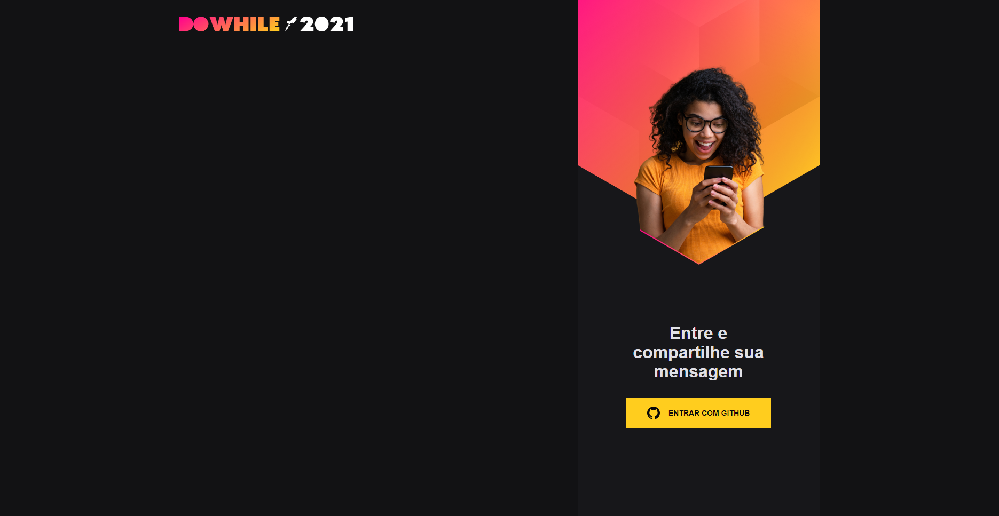
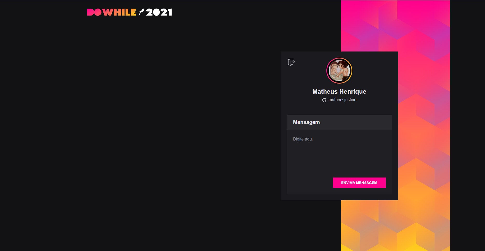
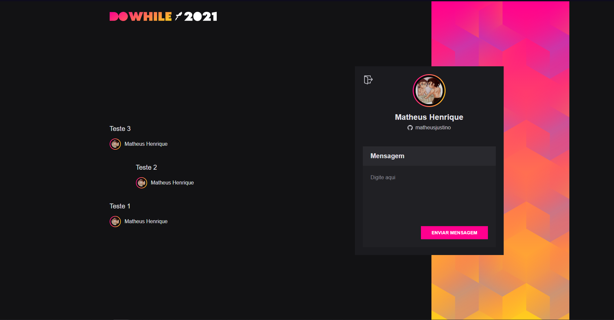

# **NLW HEAT**

## **_BACKEND_**

- API construída com NestJs.

## **_FRONTEND_**

- Frontend construído com React e Vite.

## DESCRIÇÃO

- Chat em tempo real.

## UTILIZAÇÃO

- `docker-compose up` para subir o backend
- `yarn dev` para subir o frontend
- acessar o frontend em `http://localhost:3000`
- `yarn studio` para acessar o visualizador do banco de dados
- acessar em `http://localhost:5555`

## SCREENSHOTS

